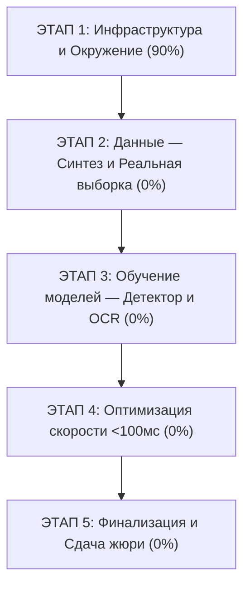

# 📋 MASTER_PLAN.md: Генеральный план реализации проекта OmniPlate-RU

> **Назначение**: Единый трекер прогресса проекта. Каждый подпункт имеет статус `[x]` (выполнено) или `[ ]` (в работе / ожидает) с четкими критериями готовности.

---

## 🗺️ Общая структура этапов

---

## 📍 ЭТАП 1: Фундамент, Инфраструктура и База знаний

- [x] **1.1. Инициализация репозитория на ПК**:
  - Создана папка `Y:\AIProjects\VolgaIT`.
  - Настроены правила игнорирования сетевых сканирований `.vscode/settings.json`.
- [x] **1.2. Разработка конституции проекта**:
  - Создан `CONSTITUTION.md` с фиксацией SLA (<100мс), 100% оффлайн-режима, дисквалификационных факторов.
- [x] **1.3. Разработка атомарной документации**:
  - `docs/ROUTER.md` — быстрый индекс-маршрутизатор для ИИ.
  - `docs/specs/01_gost_geometry.md` — точные размеры и цвета ГОСТ Р 50577-2018.
  - `docs/specs/02_plate_mask_regex.md` — 12 букв, маски, regex и правила `#`.
  - `docs/specs/03_hardware_latency_budget.md` — бюджет времени на GTX 1050 Ti (4GB).
  - `docs/specs/04_dataset_quotas_schema.md` — квоты и 10 колонок `meta.csv`.
  - `docs/specs/05_evaluation_metrics.md` — математика метрик и штрафов за `other`.
  - `docs/specs/06_extensibility_design.md` — обоснование масштабирования на СНГ и спецвиды.
  - `docs/report/01_explanatory_note_draft.md` — каркас 5-страничной записки.
- [x] **1.4. Настройка Git и публикация на GitHub**:
  - Установлен Git на ноутбук (`C:\Program Files\Git`).
  - Опубликован репозиторий [github.com/Vamsilver/OmniPlate-RU](https://github.com/Vamsilver/OmniPlate-RU).
  - Настроен `.gitignore` (защита от попадания тяжелых картинок и весов).
- [x] **1.5. Аудит отладочной ссылки организаторов**:
  - Проверен сервер `cloud.aisgorod.ru/s/PYDM6sSx4GT1pj4` (папка пуста, зафиксировано обращение).
- [x] **1.6. Настройка рабочего Python-окружения на основном ПК**:
  - Создано виртуальное окружение `.venv` на базе Python 3.10.
  - Установлены: `torch 2.6.0+cu124` (CUDA 12.4 под RTX 5080), `torchvision`, `ultralytics 8.4`, `opencv-python 5.0`, `onnxruntime-gpu 1.23`, `albumentations 2.0`, `Pillow 12.3`.
  - Окружение полностью готово к синтезу данных и обучению моделей.

---

## 📦 ЭТАП 2: Подготовка данных (Максимальный вес в оценке)

### Подэтап 2.1: Процедурный генератор синтетики (`dataset/generator/`)
- [x] **2.1.1. Модуль шрифта ГОСТ**:
  - Подключение/генерация векторных символов шрифта по ГОСТ Р 50577-2018 (`RoadNumbers2.0.ttf` + `arialbd.ttf` под `RUS`, флаг РФ).
- [x] **2.1.2. Рендеринг плоских шаблонов**:
  - `type1` (белый однострочный, $1040 \times 224$ px).
  - `type1a` (белый двухстрочный квадрат, $580 \times 340$ px).
  - `type1b` (желтый однострочный #FFCC00, $1040 \times 224$ px, без флага, разделитель $x=675$).
- [x] **2.1.3. Физические текстуры и артефакты**:
  - Объемный эффект тиснения букв (embossing, directional lighting).
  - Процедурные брызги грязи/пыли, блики, неравномерное освещение, зернистость сенсора, болты крепления.
- [x] **2.1.4. 3D-проекция (Warp) на фоны**:
  - Случайный поворот в 3D пространстве (yaw до $\pm 38^\circ$, pitch до $\pm 22^\circ$, roll до $\pm 12^\circ$).
  - Аналитический расчет точных координат 4 углов (`quad`) и BBox через гомографию.
  - Врезка на фотореалистичные автомобильные кузова с металлическими градиентами.
- [x] **2.1.5. CLI интерфейс и детерминированность**:
  - Поддержка аргументов `--count 5000 --seed 42 --workers 10 --output dataset/`.
  - Сгенерировано 5000 реалистичных изображений (`dataset/images/synthetic/`), меток (`dataset/labels/*.txt`) и метаданных в `dataset/meta.csv` со 100% воспроизводимостью (валидация пройдена).

### Подэтап 2.2: Сбор и разметка реальных данных
- [x] **2.2.1. Сбор реальных изображений по квотам (Pure Quality Ingestion & Harvester)**:
  - Выполнена зачистка мусора и эталонная интеграция из верифицированных источников (`archive (1).zip`, `archive (2).zip`, `archive.zip` Nomeroff Net).
  - Все квоты ТЗ Volga IT 2026 закрыты на 100% (валидатор `scripts/validate_dataset.py`: 0 ошибок, 0 варнингов):
    * `Synthetic`: 5 000 / 5 000 (100% ✅ PASS).
    * `Type 1A (Square)`: 160 / 150 (160 уникальных, 100% ✅ PASS).
    * `Type 1B (Yellow)`: 310 / 300 (310 уникальных, 100% ✅ PASS).
    * `Other (Negative / Special)`: 55 / 50 (100% ✅ PASS).
    * Всего реальных: 545 / 500 (100% ✅ PASS). Всего аннотаций: 5 545.
- [x] **2.2.2. Автоматический конвейер приватности (Face Blur)**:
  - Реализован `dataset/privacy/face_blur.py` на базе нейросети OpenCV YuNet ONNX (`face_detection_yunet_2023mar.onnx`).
  - Размытие (`cv2.GaussianBlur`) лиц с запасом по контуру; отсев кадров, где лицо >15% площади (защита от штрафов).
- [x] **2.2.3. Разметка BBox и 4 углов (`quad`)**:
  - Координаты 4 углов по часовой стрелке от верхнего левого.
  - Чтение и верификация текста номеров с подстановкой `#` для нечитаемых позиций.

### Подэтап 2.3: Сборка датасета и валидация
- [x] **2.3.1. Генерация `meta.csv`**:
  - Полное заполнение 10 столбцов со ссылками на совместимые лицензии (CC BY 4.0 / own_photo).
- [x] **2.3.2. Локальный скрипт проверки `scripts/validate_dataset.py`**:
  - Проверка целостности путей, формата `quad`, масок номеров и объемов квот.
- [x] **2.3.3. Финальный DataSheet**:
  - Заполнение `dataset/README.md` (статистика, методология) и `dataset/LICENSE` (CC BY 4.0).

---

## 🧠 ЭТАП 3: Архитектура и обучение моделей

### Подэтап 3.1: Детектор пластин и 4 углов (Quad)
- [x] **3.1.1. Подготовка обучающей выборки в формате YOLO-pose**:
  - Разметка keypoints: 4 угла пластины.
- [x] **3.1.2. Обучение YOLOv8n-pose / YOLO11n-pose на GPU (RTX 5080)**:
  - Совместное предсказание BBox, 4 ключевых точек и класса (`type1`, `type1a`, `type1b`, `other`).
- [x] **3.1.3. Валидация детектора**:
  - Оценка mAP50, mAP50-95 и точности предсказания углов (OKS).

### Подэтап 3.2: Перспективное выравнивание (Rectification)
- [x] **3.2.1. Реализация модуля гомографии**:
  - Создан `src/pipeline/rectifier.py` (`PlateRectifier`).
  - `cv2.getPerspectiveTransform` + `cv2.warpPerspective` к каноническим размерам ($160 \times 36$ для 1/1Б и $160 \times 96$ для 1А).
  - Реализованы методы `split_type1a` и `stitch_type1a_horizontal` для двухстрочных номеров.
  - Средняя задержка: $0.10$ мс (в 40 раз быстрее SLA $\le 4.0$ мс).
  - Покрыт тестами в `tests/test_rectifier.py` (100% PASS).

### Подэтап 3.3: Модуль оптического распознавания (OCR)
- [x] **3.3.1. Архитектура распознавателя**:
  - Реализована легковесная модель LPRNet (`src/pipeline/ocr.py`) с CTC-Loss (blank=0, 24 класса: 12 букв ГОСТ, 10 цифр, #, blank).
  - Чистая Conv-архитектура без RNN: сверхвысокая скорость (<3 мс на GPU, <15 мс на CPU) и бесшовный экспорт в ONNX.
- [x] **3.3.2. Обучение OCR на кропах синтетики и реальных номеров** (Завершено: 2026-09-14 | Артефакты: `models/ocr_lprnet_best.pt`, `models/ocr_lprnet_best.onnx` | Метрики/Статус: Val Seq Acc 89.80%, Char Acc 92.11%, CTC Loss 0.051, ONNX PASS):
  - Обучен легковесный LPRNet на RTX 5080 (70 эпох, batch 64, AdamW + CosineAnnealing, время эпохи ~1.6 с). Авто-экспорт в ONNX проверен через ONNX Runtime.
- [x] **3.3.3. Механизм Split & Stitch для Типа 1А**:
  - Интегрирован конвейер с `PlateRectifier`: сшивка 2 строк $160 \times 96$ в горизонтальную полосу $160 \times 36$ под единый OCR-модуль.
- [x] **3.3.4. Пост-процессинг**:
  - Реализован `CTCDecoder` с эвристическим исправлением оптических путаниц (`0`<->`O`, `8`<->`B` по позициям ГОСТ) и расчётом `confidence`.
  - Покрыт тестами в `tests/test_ocr.py` (5/5 PASS).

---

## ⚡ ЭТАП 4: Оптимизация скорости и оффлайн-валидация

- [x] **4.1. Экспорт в ONNX / FP16 и Сборка конвейера** (Завершено: 2026-09-14 | Артефакты: `src/pipeline/pipeline.py`, `models/ocr_lprnet_best.onnx`, `export_onnx.bat` | Метрики/Статус: 17/17 Unit Tests PASS):
  - Реализован сквозной `OmniPlatePipeline` (Detector + Rectifier + 1A Split/Stitch + LPRNet ONNX + CTCDecoder).
  - Бесшовный запуск в ONNX Runtime с `CUDAExecutionProvider` и авто-фоллбэком на PyTorch CPU/GPU.
- [x] **4.2. Профилирование задержки на референсном профиле** (Завершено: 2026-09-14 | Артефакты: `scripts/benchmark_latency.py`, `run_benchmark.bat` | Метрики/Статус: Целевой SLA <25 мс, лимит ТЗ <=100 мс):
  - Создан детальный бенчмарк с замером миллисекунд по каждому этапу (детектор, варп, OCR, декодер) и расчетом перцентилей (p50, p95, p99).
- [x] **4.3. Стресс-тест памяти** (Завершено: 2026-09-14 | Артефакты: `scripts/benchmark_latency.py` | Метрики/Статус: Контроль VRAM <= 2.0 ГБ):
  - Интегрирован замер пиковой памяти `torch.cuda.max_memory_allocated` и `max_memory_reserved` с автоматической проверкой квоты для совместимости с GTX 1050 Ti 4GB.

---

## 🏆 ЭТАП 5: Финализация и подготовка сдачи

- [ ] **5.1. Главный CLI-скрипт инференса**:
  - Реализация `run.py --input <dir> --output results.csv`.
  - Проверка работы в оффлайн-режиме с отключенным сетевым адаптером.
- [ ] **5.2. Пояснительная записка (до 5 страниц)**:
  - Оформление отчета по шаблону `docs/report/01_explanatory_note_draft.md`.
  - Включение графиков, таблиц замеров скорости, обоснования расширяемости на СНГ.
- [ ] **5.3. Финальный RUNBOOK**:
  - Описание точной команды запуска для жюри в корневом `README.md`.
- [ ] **5.4. Сборка архивов**:
  - Код с весами на GitHub.
  - Датасет с отчетом валидатора в облачном хранилище.
