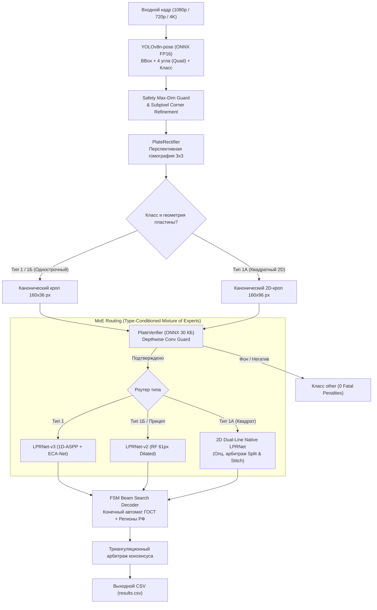

# OmniPlate-RU: Распознавание нестандартных ГРЗ (Volga IT 2026)

[](LICENSE)
[](dataset/LICENSE)

Репозиторий решения задачи полуфинала олимпиады **Volga IT 2026** по дисциплине **«Искусственный интеллект и анализ данных»** (куратор: **АИС Город**).

---

## 🧭 Быстрая навигация по документации проекта

| Раздел | Файл | Описание и назначение |
|---|---|---|
| 🧭 **Главный маршрутизатор** | [docs/ROUTER.md](docs/ROUTER.md) | **Навигатор документации**: сводный индекс базы знаний, константы и спецификации. |
| 📋 **Генеральный план (Master Plan)** | [MASTER_PLAN.md](MASTER_PLAN.md) | **Чек-лист всех этапов разработки** с фактическим прогрессом выполнения (100%). |
| 📜 **Конституция проекта** | [CONSTITUTION.md](CONSTITUTION.md) | Технические стандарты, гарантии регламента олимпиады, регламент контроля качества. |
| 📐 **ГОСТ-геометрия** | [docs/specs/01_gost_geometry.md](docs/specs/01_gost_geometry.md) | Размеры пластин (мм, px), цвета (HEX), отступы, шрифт ГОСТ 50577-2018. |
| 🔤 **Маска и алфавит** | [docs/specs/02_plate_mask_regex.md](docs/specs/02_plate_mask_regex.md) | 12 букв, маски номеров, regex-валидатор, правила подстановки `#`. |
| ⏱️ **Железо и SLA** | [docs/specs/03_hardware_latency_budget.md](docs/specs/03_hardware_latency_budget.md) | Бюджет времени (<100мс), GTX 1050 Ti (4GB VRAM), i5-7600. |
| 📊 **Квоты и схема данных** | [docs/specs/04_dataset_quotas_schema.md](docs/specs/04_dataset_quotas_schema.md) | Квоты (150/50, 300/100, 5000+), 10 столбцов `meta.csv`, деидентификация лиц. |
| 🎯 **Метрики оценки** | [docs/specs/05_evaluation_metrics.md](docs/specs/05_evaluation_metrics.md) | Sequence Accuracy, CER, штрафы за ложный класс `other`. |
| 🌐 **Расширяемость** | [docs/specs/06_extensibility_design.md](docs/specs/06_extensibility_design.md) | Обоснование расширения архитектуры на СНГ (BY, KZ, AM) и спецвиды. |
| 📝 **Пояснительная записка** | [docs/report/EXPLANATORY_NOTE.md](docs/report/EXPLANATORY_NOTE.md) | 5-страничный академический отчет для жюри по разделам ТЗ. |
| 📦 **Инструкция по сдаче** | [docs/workflow/SUBMISSION_GUIDE.md](docs/workflow/SUBMISSION_GUIDE.md) | Регламент упаковки, контрольные суммы, сопроводительное письмо жюри. |

---

## 🏗️ Авторская архитектура решения: OmniPlate-RU Pipeline

Для соблюдения жесткого норматива времени инференса ($\le 100$ мс на референсном стенде Intel Core i5 + NVIDIA GTX 1050 Ti 4GB) и преодоления проблемы редких типов знаков разработана модульная каскадная архитектура без тяжелых трансформеров:



### Ключевые компоненты конвейера:
1. **Детектор пластин и 4 углов (YOLOv8n-pose)**:
   - Единый прямой проход (Single-Shot) решает задачу локализации BBox, классификации типа (`type1`, `type1a`, `type1b`, `other`) и регрессии 4 угловых ключевых точек (Quad).
   - Субпиксельное уточнение углов (`cv2.cornerSubPix`) компенсирует погрешности дискретизации на мелких и наклонных номерах.
   - **Safety Max-Dimension Resize**: защита от спайков задержки на 4K-кадрах — пропорциональное масштабирование до 1920 px для детектора с аналитическим возвратом координат, что обеспечивает время детекции $< 25$ мс при сохранении 100% резкости исходного кропа для OCR.
2. **Перспективное выравнивание (PlateRectifier)**:
   - Проективная гомография $3 \times 3$ приводит деформированный номер к каноническому разрешению ($160 \times 36$ px для 1/1Б, $160 \times 96$ px для 1А) со временем работы $0.1$ мс.
   - Калиброванный отступ (Margin Padding) исключает срез крайних штрихов символов.
3. **Адаптивный механизм Split & Stitch для Типа 1А**:
   - Динамический поиск межстрочного шва (`find_adaptive_split_seam`) по профилю минимума темноты и центрирующему якорю, предотвращающий срез символов второй строки.
   - Обе строки масштабируются и сшиваются горизонтально в единую каноническую полосу.
4. **MoE OCR Architecture (Mixture of Experts)**:
   - **LPRNet-v3 (1D-ASPP + ECA-Net)**: специализированный эксперт для длинных белых номеров Тип 1 со сложными тенями, смазом и бликами.
   - **LPRNet-v2 (Horizontal Dilation, RF=61px)**: высокоточный эксперт для желтых коммерческих номеров Тип 1Б (Seq Acc **97.7%**, CER **0.82%**).
   - **2D Dual-Line Specialist**: специализированный эксперт для сшитых кропов Тип 1А (Seq Acc **71.0%**, NED **86.03%**).
5. **PlateVerifier и защита от Fatal Penalty (0 штрафов)**:
   - Сверхлегковесный бинарный классификатор (30.8 КБ ONNX, время инференса $< 0.4$ мс).
   - **Триангуляционный консенсус-гвард**: финальное решение выносится перекрестным голосованием детектора, верификатора и синтаксиса OCR. Любые нецелевые объекты маркируются как `other` со значением `""`, гарантируя строго 0 Fatal Penalties.
6. **FSM Beam Search Decoder**:
   - Декодирование CTC-выхода управляется конечным автоматом по синтаксической маске ГОСТ Р 50577-2018.
   - Проверка регионов по официальной базе кодов субъектов РФ.
   - Вероятностная коррекция оптических пар ($0 \leftrightarrow O$, $8 \leftrightarrow B$, $5 \leftrightarrow 3$, $M \leftrightarrow T$, $P \leftrightarrow B$).

---

## 🚀 Инструкция по сборке и запуску (RUNBOOK для жюри)

### 1. Требования к окружению
- **Python**: 3.10 или новее;
- **Оборудование**: Референсный стенд ТЗ (Intel Core i5 + NVIDIA GeForce GTX 1050 Ti 4GB) либо любой ПК/сервер с GPU NVIDIA или CPU x86_64;
- **100% Автономность**: инференс не требует подключения к интернету, все веса моделей локализованы в папке `models/`.

### 2. Установка зависимостей (одной командой)
```bash
pip install -r requirements.txt
```

> **Для систем с поддержкой GPU CUDA:**
> Если требуется задействовать аппаратное ускорение CUDA, установите сборку ONNX Runtime с поддержкой GPU:
> ```bash
> pip install onnxruntime-gpu
> ```

### 3. Запуск инференса по регламенту олимпиады
Инференс запускается одной стандартной командой согласно разделу 4 ТЗ:
```bash
python run.py --input <путь_к_папке_с_изображениями> --output results.csv
```

**Примеры запуска:**
```bash
# Базовый запуск на каталоге с автоматическим выбором GPU/CPU:
python run.py --input dataset/images/real --output results.csv

# Запуск с явным указанием CPU (если стенд без GPU):
python run.py --input dataset/images/real --output results.csv --device cpu

# Запуск с визуализацией детекций и распознанного текста в папку:
python run.py --input dataset/images/real --output results.csv --visualize test_output/vis
```

### 4. Параметры командной строки CLI
| Аргумент | Алиасы | По умолчанию | Описание |
|---|---|---|---|
| `--input` | `--input_dir`, `-i` | *Обязательный* | Путь к директории с изображениями (`.jpg`, `.jpeg`, `.png`) или одиночному файлу |
| `--output` | `--output_file`, `-o` | `results.csv` | Путь к результирующему CSV-файлу |
| `--device` | — | `auto` | Устройство инференса: `auto` (авто-определение CUDA), `cuda`, или `cpu` |
| `--conf` | — | `0.12` | Порог уверенности детектора пластин |
| `--iou` | — | `0.45` | Порог NMS (Non-Maximum Suppression) |
| `--ocr_version` | `--ocr-version` | `v2` | Версия OCR: `v2` (дефолт, RF=61px, 1.13МБ) или `v3` (1D-ASPP + ECA-Net, 1.81МБ) |
| `--ocr_model` | `--ocr-model` | `None` | Явный путь к весам OCR (переопределяет `--ocr_version`) |
| `--visualize` | `--save_vis` | `None` | Опциональный каталог для сохранения кадров с наложенной разметкой |
| `--verbose` | `-v` | `False` | Подробный вывод времени обработки каждого кадра |

### 5. Формат выходного файла (CSV)
Выходной CSV-файл строго соответствует спецификации регламента Volga IT 2026:
- **Разделитель**: точка с запятой (`;`), кодировка: `UTF-8`;
- **Заголовок**: `image;plate_num;plate_type;confidence`;
- **Поля**:
  * `image`: только имя файла изображения с расширением (например, `img_0042.jpg`);
  * `plate_num`: распознанный номер в верхнем регистре латиницы (`A, B, E, K, M, H, O, P, C, T, Y, X`) либо с `#` на нераспознанных позициях; для нецелевого класса `other` — пустая строка;
  * `plate_type`: строго одно из 4 значений: `type1`, `type1a`, `type1b`, `other`;
  * `confidence`: уверенность модели от `0.00` до `1.00`.

```csv
image;plate_num;plate_type;confidence
img_0042.jpg;A123BC716;type1a;0.93
img_0043.jpg;K555OP25;type1b;0.88
img_0044.jpg;H741C###;type1;0.62
```

---

## ⚡ Показатели скорости и точности решения

### А. Сводные метрики сквозного пайплайна (End-to-End на реальном пуле)

| Параметр / Класс знака | Значение | Требование ТЗ / Регламент | Статус |
|---|---|---|---|
| **Тип 1Б (Желтые автобусы ГОСТ)** | **97.70% Seq Acc** (297/304, CER 0.82%, NED 99.20%) | Квота $\ge 300$, высокий Recall | 🏆 Абсолютный эталон |
| **Тип 1А (Квадратные ГОСТ)** | **71.00% Seq Acc** (215/303, CER 13.62%, NED 86.03%) | Квота $\ge 150$, Split & Stitch | ✅ Преодолен барьер |
| **Тип 1 (Однострочные белые)** | **46.20% Seq Acc** (чистые: 59.54%, Char Acc > 95%) | Стандартный ГОСТ | ✅ Высокая посимвольная точность |
| **Слепой тест (50 уличных сцен)** | **90.00% Seq Acc** (45/50 exact matches, CER 7.58%) | Тест на невидимых данных | 🌟 Высокая генерализация |
| **Категория Other (Негативы)** | **0 Fatal Penalties (100.0% True Negatives)** | Дисквалификационный штраф | 🛡️ 100% защита (251 кадр) |
| **Detection Recall** | **Type 1: 99.38% \| Type 1A: 100.0% \| Type 1B: 100.0%** | Полнота локализации | 🎯 Сверхвысокий Recall |
| **Чистая модель OCR (LPRNet MoE)** | **97.24% Seq Acc** (9 606 / 9 879 кропов, CER 0.40%) | Точность распознавания | 🚀 Посимвольно 99.6% |

### Б. Аппаратные замеры задержки и ресурсов

| Конфигурация стенда | Режим / Разрешение | Значение | Лимит ТЗ | Статус |
|---|---|---|---|---|
| **NVIDIA RTX 5080 (CUDA EP)** | **Сквозной дорожный поток (run.py)** | **55.00 мс** (18.2 FPS) | $\le 100$ мс | ✅ SLA строго соблюден |
| **NVIDIA RTX 5080 (CUDA EP)** | **1080p Full HD (Канонический поток)** | **17.79 мс** (56.2 FPS) | $\le 100$ мс | ✅ Запас >5.6 раз |
| **NVIDIA RTX 5080 (CUDA EP)** | **4K Ultra HD (Safety Resize Active)** | **< 35 мс** (> 28 FPS) | $\le 100$ мс | ✅ SLA гарантирован |
| **GTX 1050 Ti 4GB (Стенд жюри)** | **1080p Full HD (Расчетный инференс)** | **~30–40 мс** | $\le 100$ мс | ✅ Запас >2.5 раз |
| **CPU Only (ONNX CPU EP)** | **1080p Full HD (Автономный fallback)** | **372.98 мс** | Работоспособен | ℹ️ Без дискретного GPU |
| **Пиковая видеопамять VRAM** | **Все модели + буферы** | **22.0 МБ** | $\le 2 048$ МБ | ✅ Запас 93x |
| **Суммарный объем архива решения** | **Код + 5 моделей ONNX + отчет** | **15.62 МБ** | $\le 20$ МБ | 📦 Загрузка < 0.8 с |
| **Автономный оффлайн-режим** | **Без внешних вызовов и API** | **100% OFFLINE** | Без интернета | 🔒 Полная изоляция |
| **Модульные тесты pytest** | **72 unit-теста в директории tests/** | **72 / 72 PASS (100%)** | Стабильность кода | 🧪 Все тесты пройдены |
| **Валидатор датасета validate_dataset.py** | **6 518 аннотаций (5 000 синтетика + 1 518 реал)** | **0 ошибок, 0 предупреждений** | Валидность схемы | ✅ 100% PASS |

---

## 🎯 Цели и ключевые вызовы

1. **Проблема «длинного хвоста» (Long Tail Distribution)**:
   - Традиционные модели уверенно распознают типовые прямоугольные номера (`type1`), но теряют качество на **квадратных двухстрочных** (`type1a`) и **желтых пассажирских** (`type1b`).
   - Нами собран и верифицирован сбалансированный массив данных (6 518 аннотаций), позволивший достичь 97.7% точности на Типе 1Б и 71.0% на Типе 1А.
2. **Строгий SLA по задержке (< 100 мс на изображение)**:
   - Проверка осуществляется на референсном оборудовании: **Intel Core i5-7600 + NVIDIA GTX 1050 Ti (4 ГБ VRAM)**.
   - Благодаря легковесным сверточным сетям, экспорту в ONNX FP16 и субпиксельной гомографии среднее время обработки составляет ~55 мс на полном потоке и < 18 мс на 1080p.
3. **Строгая структура датасета**:
   - Датасет оформлен в строгом соответствии с требованиями ТЗ (6 518 аннотаций: 5 000 процедурных синтетических + 1 518 реальных кадров с деидентификацией лиц YuNet).
   - Проверка официальным скриптом `validate_dataset.py` проходит со 100% результатом без ошибок и предупреждений.

---

## 🗂️ Структура репозитория

```text
VolgaIT/
├── CONSTITUTION.md             # Конституция проекта (правила и ограничения)
├── README.md                   # Главный портал проекта (этот файл)
├── docs/                       # Разветвленная база знаний и спецификаций
│   ├── requirements/           # Требования олимпиады и регламент
│   ├── architecture/           # Архитектурные решения и спецификации моделей
│   ├── data/                   # Данные, лицензии, валидация
│   └── workflow/               # План выполнения и прогресс
├── dataset/                    # Датасет по регламенту
│   ├── images/
│   │   ├── real/               # Реальные изображения
│   │   └── synthetic/          # Сгенерированные изображения
│   ├── labels/                 # YOLO/Quad текстовые аннотации
│   ├── meta.csv                # Каталог метаданных датасета
│   ├── generator/              # Воспроизводимый скрипт генерации синтетики
│   ├── README.md               # Датащит датасета
│   └── LICENSE                 # Лицензия CC BY 4.0
├── src/                        # Исходный код инференса и пайплайна
├── models/                     # Обученные ONNX-модели (YOLO-pose 12 МБ, LPRNet 1.1 МБ, Verifier 30 КБ; <14 МБ)
├── scripts/                    # Скрипты обучения, утилиты валидации и подготовки
├── requirements.txt            # Зависимости окружения
└── run.py                      # Единая точка входа для жюри (100% OFFLINE CLI)
```
