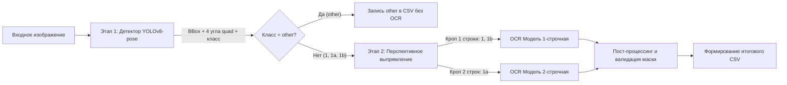

# 01. Общая архитектура системы распознавания

## 1. Концепция пайплайна (Two-Stage vs End-to-End)

Для выполнения жесткого требования к задержке ($\le 100\text{ мс}$) на GPU GTX 1050 Ti и качественного распознавания под углами выбран модульный двухэтапный пайплайн с перспективным выпрямлением (**Detection $\to$ Rectification $\to$ Classification & Recognition**).

---

## 2. Детализация модулей

### Модуль 1: Детекция и поиск углов (Plate Detection & Corner Keypoints)
- **Модель**: `YOLOv8n-pose` или `YOLO11n-pose`.
- **Задачи**:
  1. Локализация номерной пластины на кадре (Bounding Box).
  2. Предсказание координат 4 ключевых точек (углов) знака: $[(x_1, y_1), (x_2, y_2), (x_3, y_3), (x_4, y_4)]$ в порядке по часовой стрелке от верхнего левого угла.
  3. Первичная классификация типа пластины (`type1`, `type1a`, `type1b`, `other`).
- **Преимущество keypoint-подхода**:
  - Исключает необходимость отдельной тяжелой Spatial Transformer Network (STN).
  - Прямо решает проблему перспективных искажений при съёмке под углом.

---

### Модуль 2: Геометрическое выравнивание (Warp Perspective)
- **Алгоритм**: `cv2.getPerspectiveTransform` + `cv2.warpPerspective`.
- **Действие**:
  - По 4 ключевым точкам вычисляется матрица гомографии к каноническому размеру:
    - Для `type1` и `type1b` (соотношение сторон $\approx 4.64:1$) $\to$ размер $128 \times 32$ px (или $160 \times 36$ px).
    - Для `type1a` (соотношение сторон $\approx 1.7:1$) $\to$ размер $128 \times 64$ px (или $160 \times 80$ px).
  - Время работы на CPU/GPU: $\approx 0.5 - 1.0\text{ мс}$ на пластину!

---

### Модуль 3: Классификация и OCR (Text Recognition)
- **Стратегия для типов знаков**:
  - **Для `type1` и `type1b`**:
    - Однострочный компактный OCR (LPRNet или CRNN с MobileNetV3 backbone + CTC Decode).
    - Выход: 8 или 9 символов (`A123BC777`).
  - **Для `type1a` (двухстрочный квадрат)**:
    - *Вариант А (Разделение на строки)*: геометрический срез кропа на верхнюю половину ($1$ буква $+ 3$ цифры) и нижнюю половину ($2$ буквы $+$ код региона), после чего подача в единый строчный OCR.
    - *Вариант Б (Специализированная 2D-OCR модель)*: обучение модели распознавать 2-строчную матрицу признаков сразу.
  - **Для `other`**:
    - Если детектор уверен, что объект относится к классу `other` (мотоцикл, иностранный номер, щит), знак сразу заносится в CSV с типом `other` и пустым/отсеченным номером без траты времени на OCR.

---

### Модуль 4: Пост-процессинг и проверка регулярным выражением
- Применение языковой/форматной маски ГОСТ:
  - Позиция 0: Буква из разрешенных (`A, B, E, K, M, H, O, P, C, T, Y, X`).
  - Позиции 1..3: Цифры `0-9`.
  - Позиции 4..5: Буквы из разрешенных.
  - Позиции 6..8: Код региона (2 или 3 цифры).
- Если символ имеет низкую вероятность или CTC-blank $\to$ подстановка `#`.
- Проверка цвета пластины (HSV анализ кропа для дополнительной верификации `type1` vs `type1b` желтого цвета).
