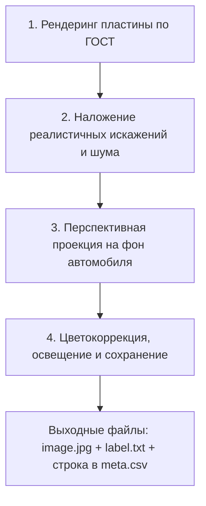

# 04. Спецификация генератора синтетических данных

## 1. Цель генератора

Сгенерировать обучающую выборку объемом **не менее 5000 изображений** высокой степени реалистичности, полностью закрывающую дефицит редких типов номеров:
- `type1a` (двухстрочные квадратные белые);
- `type1b` (однострочные жёлтые);
- `type1` (однострочные белые для сохранения баланса).

Генератор оформляется в виде автономного скрипта в папке `dataset/generator/` с фиксируемым аргументом `--seed` для воспроизводимости жюри.

---

## 2. Архитектура генерации (Procedural Plate Synthesis)

Генерация состоит из трех ключевых этапов:



### Этап 1: Рендеринг векторного макета пластины
1. **Шрифт**: Официальный ГОСТ-шрифт для автомобильных номеров РФ (ГОСТ Р 50577-93 / ГОСТ Р 50577-2018).
2. **Геометрия и отступы**:
   - `type1`: белая пластина $520 \times 112$, черный кант, флаг РФ, надпись RUS.
   - `type1a`: квадратная белая пластина $290 \times 170$, две строки (буква+3 цифры сверху, 2 буквы+регион+RUS снизу).
   - `type1b`: желтая пластина (цвет Pantone 116C / RGB `(255, 204, 0)`), без флага, надпись RUS.
3. **Генерация номера**: случайная валидная комбинация букв и кодов реальных регионов РФ.

### Этап 2: Текстурирование и физические дефекты
- **Фактура**: микрорельеф выдавленных букв (штамповка / тиснение с легкой тенью/светом по контуру).
- **Загрязнения**: пятна грязи, пыли, брызги (Perlin noise / маски текстур грязи).
- **Блики и тени**: градиентные карты освещения, имитация вспышки ИК-подсветки камеры.
- **Болты крепления**: добавление шляпок винтов/болтов в стандартных местах крепления знака.

### Этап 3: Проекция на сцену (3D Perspective Warp)
- Случайная выборка углов наклона (yaw $\pm 45^\circ$, pitch $\pm 30^\circ$, roll $\pm 15^\circ$).
- Расчет матрицы гомографии $M$.
- Наложение с альфа-блендингом на реальные фоновые фотографии задней/передней части автомобилей (свободные фоны без номеров).
- При этом **точные координаты 4 углов (`quad`) вычисляются автоматически аналитически** из матрицы гомографии!

### Этап 4: Окружающие условия и аугментации
- Имитация условий съёмки:
  - `day` (дневной свет),
  - `night` (ночь, шум матрицы, локальный свет фар/фонаря),
  - `rain` / `snow` (размытие, капли на оптике),
  - `motion_blur` (смаз от движения автомобиля).
- Автоматическая простановка тегов в `conditions` для `meta.csv`.

---

## 3. CLI интерфейс скрипта генератора

```bash
python dataset/generator/generate_synthetic.py \
    --count 5000 \
    --seed 42 \
    --output_dir dataset/ \
    --type1_ratio 0.2 \
    --type1a_ratio 0.4 \
    --type1b_ratio 0.4
```
Параметр `--seed` гарантирует попиксельную воспроизводимость синтетического набора при повторном запуске жюри.
