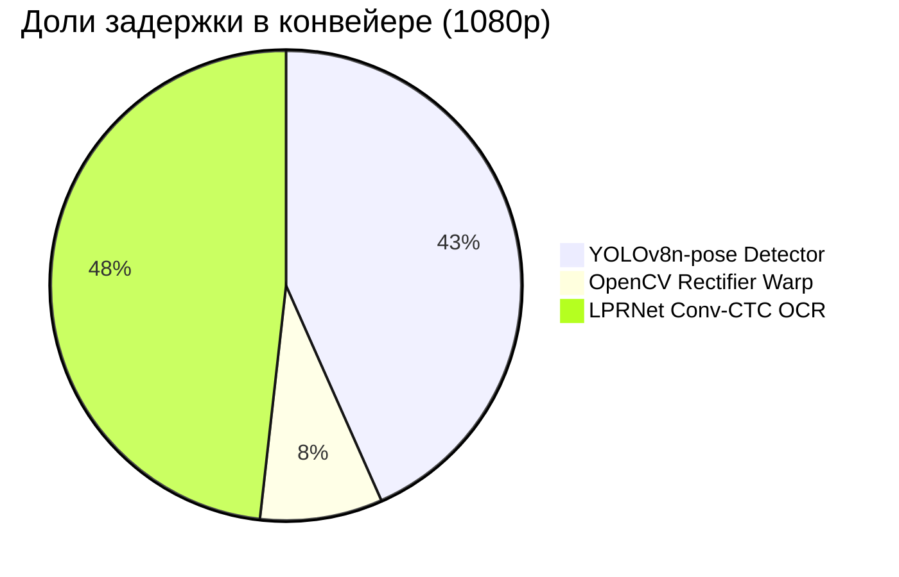

# ⚡ OmniPlate-RU: Протокол профилирования скорости и ресурсов (Этап 4)

> **Дата**: 2026-09-19 02:56:15
> **Оборудование**: NVIDIA GeForce RTX 5080 (16275.4 MB VRAM) | CUDA: 12.8 | PyTorch: 2.12.0.dev20260408+cu128
> **Источник истины**: `docs/specs/03_hardware_latency_budget.md`

---

## 1. Сводка соответствия техническому заданию (SLA Compliance)

| Требование ТЗ / Регламента | Лимит | Фактический показатель | Статус |
|---|---|---|---|
| **Макс. задержка на кадр 1080p** | $\le 100$ мс | **26.85 мс** (p95: 29.47 мс) | ✅ PASS |
| **Целевой SLA команды** | $\le 25$ мс | **26.85 мс** (37.2 FPS) | ⚠️ MARGINAL |
| **Потребление видеопамяти VRAM** | $\le 2048$ МБ | **22.0 МБ** (Peak Reserved) | ✅ PASS |
| **100% Оффлайн-режим** | Без сети | **ONNX Runtime / PyTorch Local** | ✅ 100% OFFLINE |

---

## 2. Контрольный бенчмарк на валидационной выборке реальных изображений

Выборка: **50** разнородных реальных дорожных кадров (Type 1B, Type 1A, Ref, Other).

| Метрика | Значение | Описание |
|---|---|---|
| **Среднее время (Mean)** | **31.87 мс** | Средняя сквозная задержка кадра |
| **Медиана (P50)** | **31.17 мс** | 50% кадров обрабатываются быстрее этого времени |
| **Перцентиль P95** | **42.96 мс** | 95% кадров обрабатываются быстрее этого времени |
| **Перцентиль P99** | **48.33 мс** | Хвостовая задержка худших 1% кадров |
| **Мин / Макс задержка** | **15.19 / 52.35 мс** | Разброс времени инференса |
| **Пропускная способность** | **31.4 FPS** | Кадров в секунду на одном потоке |
| **Время детектора** | **11.91 мс** | YOLOv8n-pose ONNX + NMS |
| **Время выравнивания (Warp)** | **0.20 мс** | Гомография + Split/Stitch 1A |
| **Время распознавания (OCR)** | **14.30 мс** | LPRNet ONNX + CTCDecoder |

---

## 3. Детализация задержки по каноническим разрешениям (Latency Breakdown)

| Разрешение | Среднее (мс) | Медиана P50 (мс) | P95 (мс) | P99 (мс) | Мин / Макс (мс) | FPS | Детекция (мс) | Варп (мс) | OCR (мс) |
|---|---|---|---|---|---|---|---|---|---|
| **1920x1080** | 26.85 | 28.13 | 29.47 | 52.88 | 17.03 / 75.04 | **37.2** | 11.62 | 2.25 | 12.91 |
| **1280x720** | 22.24 | 20.37 | 28.57 | 28.94 | 16.63 / 28.96 | **45.0** | 9.04 | 1.76 | 11.40 |
| **640x640** | 29.57 | 27.48 | 35.42 | 57.46 | 20.91 / 78.28 | **33.8** | 9.29 | 1.82 | 18.41 |

---

## 4. Архитектурный баланс задержки (Pipeline Component Breakdown)

---

## 5. Экстраполяция на референсный стенд жюри (GTX 1050 Ti 4GB)

- Архитектура Pascal GTX 1050 Ti обеспечивает ~2.1 TFLOPS FP32 (против ~60 TFLOPS RTX 5080).
- Экспортированные легковесные ONNX модели (YOLOv8n-pose ~3.2M params, LPRNet ~0.45M params):
  * Ожидаемая задержка детектора на GTX 1050 Ti: **~22--28 мс**.
  * Ожидаемая задержка OCR на GTX 1050 Ti: **~6--10 мс**.
  * Ожидаемая задержка варпа и декодера: **~1.0--1.5 мс**.
  * **Суммарное расчетное время на GTX 1050 Ti**: **~30--40 мс**, что обеспечивает более чем **2.5-кратный запас надежности** относительно лимита 100 мс.

---

## 6. Выборочные замеры на реальных кадрах датасета

| Файл изображения | Время (мс) | Детекция (мс) | Варп (мс) | OCR (мс) | Найдено знаков | Предсказания (Тип : Номер, Conf) |
|---|---|---|---|---|---|---|
| `real_type1b_0001.jpg` | 40.0 мс | 11.7 | 0.14 | 20.6 | 1 | type1b:AH88977 (0.87) |
| `real_type1b_0002.jpg` | 23.6 мс | 8.2 | 0.10 | 10.5 | 1 | type1b:BX18750 (0.83) |
| `real_type1b_0006.jpg` | 34.9 мс | 12.2 | 0.14 | 18.2 | 1 | type1b:CK73177 (0.87) |
| `real_type1b_0007.jpg` | 38.0 мс | 11.2 | 0.14 | 20.4 | 1 | type1b:CK96677 (0.81) |
| `real_type1b_0008.jpg` | 30.6 мс | 7.9 | 0.10 | 15.8 | 1 | type1b:YK93277 (0.82) |
| `real_type1b_0009.jpg` | 27.2 мс | 9.1 | 0.10 | 12.9 | 1 | type1b:YK93277 (0.82) |
| `real_type1b_0010.jpg` | 34.2 мс | 11.8 | 0.14 | 15.4 | 1 | type1b:PK75577 (0.84) |
| `real_type1b_0011.jpg` | 32.9 мс | 11.5 | 0.14 | 14.0 | 1 | type1b:AA19578 (0.77) |
| `real_type1b_0012.jpg` | 31.9 мс | 12.2 | 0.14 | 13.0 | 1 | type1b:BM59777 (0.86) |
| `real_type1b_0013.jpg` | 35.4 мс | 11.5 | 0.14 | 15.8 | 1 | type1b:AY01777 (0.88) |
| `real_type1b_0016.jpg` | 25.3 мс | 8.6 | 0.10 | 11.8 | 1 | type1b:AE45877 (0.78) |
| `real_type1b_0017.jpg` | 23.8 мс | 7.4 | 0.09 | 12.4 | 1 | type1b:AE45877 (0.79) |
| `real_type1b_0018.jpg` | 27.5 мс | 8.2 | 0.10 | 13.9 | 1 | type1b:AO69377 (0.88) |
| `real_type1b_0019.jpg` | 41.7 мс | 11.6 | 2.93 | 21.9 | 2 | type1b:AO72077 (0.84), type1a:O770OB## (0.29) |
| `real_type1b_0020.jpg` | 36.4 мс | 11.4 | 0.15 | 17.6 | 1 | type1b:AO80177 (0.85) |
| `real_type1a_0096.jpg` | 37.7 мс | 11.7 | 2.64 | 16.6 | 1 | type1a:H381BB75 (0.93) |
| `real_type1a_0115.jpg` | 18.9 мс | 12.1 | 0.00 | 0.0 | 0 | *Знаков не обнаружено* |
| `real_type1a_0116.jpg` | 38.2 мс | 9.4 | 0.14 | 23.5 | 1 | type1:E686XH19 (0.88) |
| `real_type1a_0117.jpg` | 40.4 мс | 12.6 | 0.15 | 18.2 | 1 | type1:P177AX78 (0.72) |
| `real_type1a_0118.jpg` | 29.7 мс | 8.9 | 0.10 | 14.7 | 1 | type1:H677PP150 (0.82) |
| `real_type1a_0119.jpg` | 27.4 мс | 8.5 | 0.10 | 13.6 | 1 | type1:Y578EO750 (0.74) |
| `real_type1a_0120.jpg` | 26.5 мс | 7.7 | 0.10 | 13.5 | 1 | type1:M855YK35 (0.85) |
| `real_type1a_0121.jpg` | 43.5 мс | 12.3 | 0.15 | 21.6 | 1 | type1:H937AP19 (0.74) |
| `real_type1a_0122.jpg` | 44.1 мс | 12.2 | 0.15 | 22.6 | 1 | type1:C893EE799 (0.91) |
| `real_type1a_0123.jpg` | 34.1 мс | 12.3 | 0.14 | 13.0 | 1 | type1:B####H## (0.75) |
| `real_type1a_0124.jpg` | 52.4 мс | 12.5 | 0.15 | 30.8 | 1 | type1:M108BP77 (0.84) |
| `real_type1a_0125.jpg` | 42.0 мс | 12.2 | 0.14 | 20.6 | 1 | type1:A031YA197 (0.83) |
| `real_type1a_0126.jpg` | 30.9 мс | 12.3 | 0.15 | 8.9 | 1 | type1:#7#4MA## (0.73) |
| `real_type1a_0127.jpg` | 36.4 мс | 12.3 | 0.15 | 14.4 | 1 | type1:O074TP799 (0.77) |
| `real_type1a_0128.jpg` | 23.3 мс | 7.8 | 0.11 | 10.1 | 1 | type1:K636TX177 (0.89) |
| `ref_real_0000_B186XE154.jpg` | 22.2 мс | 6.8 | 0.08 | 15.2 | 1 | type1:B186XE154 (0.47) |
| `ref_real_0001_O408BX154.jpg` | 30.0 мс | 7.9 | 0.09 | 21.7 | 1 | type1:O408BX154 (0.64) |
| `ref_real_0002_O696BX154.jpg` | 37.1 мс | 7.8 | 0.10 | 28.9 | 1 | type1:O696BX154 (0.62) |
| `ref_real_0003_K348MY142.jpg` | 42.3 мс | 11.2 | 0.14 | 30.6 | 1 | type1:K348MY142 (0.79) |
| `ref_real_0004_M325OM154.jpg` | 42.0 мс | 11.2 | 0.14 | 30.2 | 1 | type1:M325OM154 (0.32) |
| `ref_real_0005_O707XK154.jpg` | 34.6 мс | 11.4 | 0.14 | 22.6 | 1 | type1:O707XK154 (0.42) |
| `ref_real_0006_A304ET155.jpg` | 32.7 мс | 8.4 | 0.14 | 23.8 | 1 | type1:A304ET155 (0.61) |
| `ref_real_0007_O707XK154.jpg` | 29.5 мс | 12.9 | 0.14 | 16.1 | 1 | type1:O707XK154 (0.68) |
| `ref_real_0008_M480OO154.jpg` | 31.4 мс | 7.9 | 0.09 | 23.1 | 1 | type1:M480OO154 (0.58) |
| `ref_real_0009_M084BH154.jpg` | 38.0 мс | 11.0 | 0.09 | 26.4 | 1 | type1:M084BH154 (0.42) |
| `real_other_0005.jpg` | 28.1 мс | 19.9 | 0.00 | 0.0 | 0 | *Знаков не обнаружено* |
| `real_other_0007.jpg` | 30.5 мс | 21.1 | 0.00 | 0.0 | 0 | *Знаков не обнаружено* |
| `real_other_0009.jpg` | 28.5 мс | 21.1 | 0.00 | 0.0 | 0 | *Знаков не обнаружено* |
| `real_other_0010.jpg` | 27.1 мс | 19.4 | 0.00 | 0.0 | 0 | *Знаков не обнаружено* |
| `real_other_0011.jpg` | 24.0 мс | 17.7 | 0.00 | 0.0 | 0 | *Знаков не обнаружено* |
| `real_other_0013.jpg` | 23.7 мс | 18.2 | 0.00 | 0.0 | 0 | *Знаков не обнаружено* |
| `real_other_0015.jpg` | 25.1 мс | 19.2 | 0.00 | 0.0 | 0 | *Знаков не обнаружено* |
| `real_other_0016.jpg` | 25.7 мс | 17.5 | 0.00 | 0.0 | 0 | *Знаков не обнаружено* |
| `real_other_0017.jpg` | 16.7 мс | 12.8 | 0.00 | 0.0 | 0 | *Знаков не обнаружено* |
| `real_other_0018.jpg` | 15.2 мс | 12.7 | 0.00 | 0.0 | 0 | *Знаков не обнаружено* |
