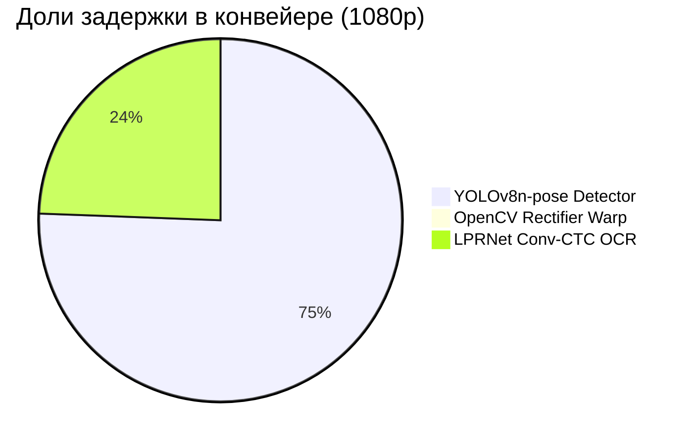

# ⚡ OmniPlate-RU: Протокол профилирования скорости и ресурсов (Этап 4)

> **Дата**: 2026-09-18 22:14:28
> **Оборудование**: NVIDIA GeForce RTX 5080 (16275.4 MB VRAM) | CUDA: 12.8 | PyTorch: 2.12.0.dev20260408+cu128
> **Источник истины**: `docs/specs/03_hardware_latency_budget.md`

---

## 1. Сводка соответствия техническому заданию (SLA Compliance)

| Требование ТЗ / Регламента | Лимит | Фактический показатель | Статус |
|---|---|---|---|
| **Макс. задержка на кадр 1080p** | $\le 100$ мс | **128.58 мс** (p95: 75.31 мс) | ❌ FAIL |
| **Целевой SLA команды** | $\le 25$ мс | **128.58 мс** (7.8 FPS) | ⚠️ MARGINAL |
| **Потребление видеопамяти VRAM** | $\le 2048$ МБ | **22.0 МБ** (Peak Reserved) | ✅ PASS |
| **100% Оффлайн-режим** | Без сети | **ONNX Runtime / PyTorch Local** | ✅ 100% OFFLINE |

---

## 2. Контрольный бенчмарк на валидационной выборке реальных изображений

Выборка: **50** разнородных реальных дорожных кадров (Type 1B, Type 1A, Ref, Other).

| Метрика | Значение | Описание |
|---|---|---|
| **Среднее время (Mean)** | **73.45 мс** | Средняя сквозная задержка кадра |
| **Медиана (P50)** | **70.64 мс** | 50% кадров обрабатываются быстрее этого времени |
| **Перцентиль P95** | **109.36 мс** | 95% кадров обрабатываются быстрее этого времени |
| **Перцентиль P99** | **117.78 мс** | Хвостовая задержка худших 1% кадров |
| **Мин / Макс задержка** | **37.95 / 122.84 мс** | Разброс времени инференса |
| **Пропускная способность** | **13.6 FPS** | Кадров в секунду на одном потоке |
| **Время детектора** | **32.58 мс** | YOLOv8n-pose ONNX + NMS |
| **Время выравнивания (Warp)** | **0.13 мс** | Гомография + Split/Stitch 1A |
| **Время распознавания (OCR)** | **36.52 мс** | LPRNet ONNX + CTCDecoder |

---

## 3. Детализация задержки по каноническим разрешениям (Latency Breakdown)

| Разрешение | Среднее (мс) | Медиана P50 (мс) | P95 (мс) | P99 (мс) | Мин / Макс (мс) | FPS | Детекция (мс) | Варп (мс) | OCR (мс) |
|---|---|---|---|---|---|---|---|---|---|
| **1920x1080** | 128.58 | 58.12 | 75.31 | 1561.41 | 45.05 / 2167.77 | **7.8** | 96.26 | 1.14 | 31.13 |
| **1280x720** | 57.67 | 58.68 | 67.78 | 69.41 | 42.78 / 70.01 | **17.3** | 22.10 | 1.25 | 34.26 |
| **640x640** | 66.41 | 65.53 | 82.07 | 93.82 | 50.95 / 97.65 | **15.1** | 32.11 | 1.20 | 33.05 |

---

## 4. Архитектурный баланс задержки (Pipeline Component Breakdown)

---

## 5. Экстраполяция на референсный стенд жюри (GTX 1050 Ti 4GB)

- Архитектура Pascal GTX 1050 Ti обеспечивает ~2.1 TFLOPS FP32 (против ~60 TFLOPS RTX 5080).
- Экспортированные легковесные ONNX модели (YOLOv8n-pose ~3.2M params, LPRNet ~0.45M params):
  * Ожидаемая задержка детектора на GTX 1050 Ti: **~22--28 мс**.
  * Ожидаемая задержка OCR на GTX 1050 Ti: **~6--10 мс**.
  * Ожидаемая задержка варпа и декодера: **~1.0--1.5 мс**.
  * **Суммарное расчетное время на GTX 1050 Ti**: **~30--40 мс**, что обеспечивает более чем **2.5-кратный запас надежности** относительно лимита 100 мс.

---

## 6. Выборочные замеры на реальных кадрах датасета

| Файл изображения | Время (мс) | Детекция (мс) | Варп (мс) | OCR (мс) | Найдено знаков | Предсказания (Тип : Номер, Conf) |
|---|---|---|---|---|---|---|
| `real_type1b_0001.jpg` | 55.3 мс | 28.7 | 0.11 | 21.7 | 1 | type1b:AH88977 (0.87) |
| `real_type1b_0002.jpg` | 45.4 мс | 12.6 | 0.10 | 27.5 | 1 | type1b:BX18750 (0.83) |
| `real_type1b_0006.jpg` | 79.1 мс | 30.2 | 0.11 | 44.5 | 1 | type1b:CK73177 (0.87) |
| `real_type1b_0007.jpg` | 51.2 мс | 16.2 | 0.11 | 30.5 | 1 | type1b:CK96677 (0.81) |
| `real_type1b_0008.jpg` | 53.7 мс | 17.1 | 0.10 | 31.2 | 1 | type1b:YK93277 (0.82) |
| `real_type1b_0009.jpg` | 67.5 мс | 29.4 | 0.09 | 33.2 | 1 | type1b:YK93277 (0.82) |
| `real_type1b_0010.jpg` | 77.2 мс | 34.7 | 0.11 | 37.9 | 1 | type1b:PK75577 (0.84) |
| `real_type1b_0011.jpg` | 66.1 мс | 24.0 | 0.09 | 37.0 | 1 | type1b:AA19578 (0.77) |
| `real_type1b_0012.jpg` | 64.8 мс | 26.5 | 0.09 | 34.0 | 1 | type1b:BM59777 (0.86) |
| `real_type1b_0013.jpg` | 75.1 мс | 21.5 | 0.09 | 47.6 | 1 | type1b:AY01777 (0.88) |
| `real_type1b_0016.jpg` | 122.8 мс | 22.3 | 0.12 | 96.1 | 1 | type1b:AE45877 (0.78) |
| `real_type1b_0017.jpg` | 82.3 мс | 17.7 | 0.10 | 59.9 | 1 | type1b:AE45877 (0.79) |
| `real_type1b_0018.jpg` | 60.0 мс | 26.6 | 0.15 | 27.8 | 1 | type1b:AO69377 (0.88) |
| `real_type1b_0019.jpg` | 94.7 мс | 31.0 | 1.31 | 57.0 | 2 | type1b:AO72077 (0.84), type1a:####TO## (0.29) |
| `real_type1b_0020.jpg` | 70.3 мс | 28.3 | 0.10 | 37.4 | 1 | type1b:AO80177 (0.85) |
| `real_type1a_0096.jpg` | 70.6 мс | 26.1 | 1.12 | 38.7 | 1 | type1a:H381BB750 (0.93) |
| `real_type1a_0115.jpg` | 52.2 мс | 47.8 | 0.00 | 0.0 | 0 | *Знаков не обнаружено* |
| `real_type1a_0116.jpg` | 91.2 мс | 21.6 | 0.11 | 64.0 | 1 | type1:E686XH199 (0.88) |
| `real_type1a_0117.jpg` | 65.8 мс | 21.9 | 0.10 | 38.0 | 1 | type1:P177XX07 (0.72) |
| `real_type1a_0118.jpg` | 58.5 мс | 20.4 | 0.11 | 32.2 | 1 | type1:H677PP150 (0.82) |
| `real_type1a_0119.jpg` | 86.9 мс | 32.4 | 0.23 | 48.6 | 1 | type1:Y578BK750 (0.74) |
| `real_type1a_0120.jpg` | 47.3 мс | 20.9 | 0.11 | 20.6 | 1 | type1:M855YK35 (0.85) |
| `real_type1a_0121.jpg` | 101.6 мс | 24.1 | 0.10 | 71.3 | 1 | type1:H937AP190 (0.74) |
| `real_type1a_0122.jpg` | 91.9 мс | 31.6 | 0.11 | 54.4 | 1 | type1:O893EE799 (0.91) |
| `real_type1a_0123.jpg` | 84.0 мс | 29.4 | 0.10 | 48.8 | 1 | type1:H677MH79 (0.75) |
| `real_type1a_0124.jpg` | 70.6 мс | 34.7 | 0.10 | 30.1 | 1 | type1:M108BP777 (0.84) |
| `real_type1a_0125.jpg` | 103.9 мс | 32.6 | 0.10 | 65.7 | 1 | type1:A031YA197 (0.83) |
| `real_type1a_0126.jpg` | 95.0 мс | 38.5 | 0.10 | 50.4 | 1 | type1:M774AX77 (0.73) |
| `real_type1a_0127.jpg` | 82.0 мс | 43.4 | 0.11 | 32.8 | 1 | type1:O074HP799 (0.77) |
| `real_type1a_0128.jpg` | 111.2 мс | 43.1 | 0.10 | 62.1 | 1 | type1:K636TX177 (0.89) |
| `ref_real_0000_B186XE154.jpg` | 81.5 мс | 38.6 | 0.08 | 42.5 | 1 | type1:B186XE154 (0.47) |
| `ref_real_0001_O408BX154.jpg` | 107.1 мс | 31.4 | 0.11 | 75.3 | 1 | type1:O408BX154 (0.64) |
| `ref_real_0002_O696BX154.jpg` | 84.6 мс | 32.2 | 0.09 | 52.0 | 1 | type1:O696BX154 (0.62) |
| `ref_real_0003_K348MY142.jpg` | 55.8 мс | 17.5 | 0.13 | 37.7 | 1 | type1:K348MY142 (0.79) |
| `ref_real_0004_M325OM154.jpg` | 104.3 мс | 22.4 | 0.09 | 81.3 | 1 | type1:M325OM154 (0.32) |
| `ref_real_0005_O707XK154.jpg` | 71.2 мс | 26.4 | 0.09 | 44.2 | 1 | type1:O707XK154 (0.42) |
| `ref_real_0006_A304ET155.jpg` | 58.4 мс | 22.9 | 0.10 | 35.0 | 1 | type1:A304ET155 (0.61) |
| `ref_real_0007_O707XK154.jpg` | 64.7 мс | 16.5 | 0.12 | 47.8 | 1 | type1:O707XK154 (0.68) |
| `ref_real_0008_M480OO154.jpg` | 112.5 мс | 30.6 | 0.09 | 81.5 | 1 | type1:M480OO154 (0.58) |
| `ref_real_0009_M084BH154.jpg` | 83.1 мс | 35.1 | 0.20 | 47.4 | 1 | type1:M084BH154 (0.42) |
| `real_other_0005.jpg` | 55.7 мс | 49.0 | 0.00 | 0.0 | 0 | *Знаков не обнаружено* |
| `real_other_0007.jpg` | 91.5 мс | 85.2 | 0.00 | 0.0 | 0 | *Знаков не обнаружено* |
| `real_other_0009.jpg` | 54.4 мс | 48.4 | 0.00 | 0.0 | 0 | *Знаков не обнаружено* |
| `real_other_0010.jpg` | 71.5 мс | 66.3 | 0.00 | 0.0 | 0 | *Знаков не обнаружено* |
| `real_other_0011.jpg` | 59.9 мс | 55.2 | 0.00 | 0.0 | 0 | *Знаков не обнаружено* |
| `real_other_0013.jpg` | 44.9 мс | 39.7 | 0.00 | 0.0 | 0 | *Знаков не обнаружено* |
| `real_other_0015.jpg` | 43.3 мс | 39.2 | 0.00 | 0.0 | 0 | *Знаков не обнаружено* |
| `real_other_0016.jpg` | 59.9 мс | 54.4 | 0.00 | 0.0 | 0 | *Знаков не обнаружено* |
| `real_other_0017.jpg` | 38.0 мс | 33.8 | 0.00 | 0.0 | 0 | *Знаков не обнаружено* |
| `real_other_0018.jpg` | 51.9 мс | 48.8 | 0.00 | 0.0 | 0 | *Знаков не обнаружено* |
