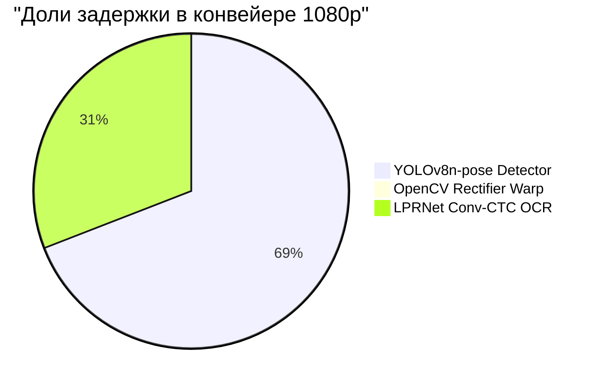

# ⚡ OmniPlate-RU: Протокол профилирования скорости и ресурсов (Этап 4)

> **Дата**: 2026-09-19 02:56:54
> **Оборудование**: NVIDIA GeForce RTX 5080 (16275.4 MB VRAM) | CUDA: 12.8 | PyTorch: 2.12.0.dev20260408+cu128
> **Источник истины**: `docs/specs/03_hardware_latency_budget.md`

---

## 1. Сводка соответствия техническому заданию (SLA Compliance)

| Требование ТЗ / Регламента | Лимит | Фактический показатель | Статус |
|---|---|---|---|
| **Макс. задержка на кадр 1080p** | $\le 100$ мс | **479.55 мс** (p95: 583.82 мс) | ❌ FAIL |
| **Целевой SLA команды** | $\le 25$ мс | **479.55 мс** (2.1 FPS) | ⚠️ MARGINAL |
| **Потребление видеопамяти VRAM** | $\le 2048$ МБ | **0.0 МБ** (Peak Reserved) | ✅ PASS |
| **100% Оффлайн-режим** | Без сети | **ONNX Runtime / PyTorch Local** | ✅ 100% OFFLINE |

---

## 2. Контрольный бенчмарк на валидационной выборке реальных изображений

Выборка: **50** разнородных реальных дорожных кадров (Type 1B, Type 1A, Ref, Other).

| Метрика | Значение | Описание |
|---|---|---|
| **Среднее время (Mean)** | **374.80 мс** | Средняя сквозная задержка кадра |
| **Медиана (P50)** | **441.07 мс** | 50% кадров обрабатываются быстрее этого времени |
| **Перцентиль P95** | **582.78 мс** | 95% кадров обрабатываются быстрее этого времени |
| **Перцентиль P99** | **600.75 мс** | Хвостовая задержка худших 1% кадров |
| **Мин / Макс задержка** | **42.13 / 603.98 мс** | Разброс времени инференса |
| **Пропускная способность** | **2.7 FPS** | Кадров в секунду на одном потоке |
| **Время детектора** | **256.71 мс** | YOLOv8n-pose ONNX + NMS |
| **Время выравнивания (Warp)** | **0.21 мс** | Гомография + Split/Stitch 1A |
| **Время распознавания (OCR)** | **111.60 мс** | LPRNet ONNX + CTCDecoder |

---

## 3. Детализация задержки по каноническим разрешениям (Latency Breakdown)

| Разрешение | Среднее (мс) | Медиана P50 (мс) | P95 (мс) | P99 (мс) | Мин / Макс (мс) | FPS | Детекция (мс) | Варп (мс) | OCR (мс) |
|---|---|---|---|---|---|---|---|---|---|
| **1920x1080** | 479.55 | 520.00 | 583.82 | 611.83 | 211.17 / 618.83 | **2.1** | 329.45 | 2.75 | 147.29 |
| **1280x720** | 368.95 | 381.28 | 485.01 | 493.15 | 199.04 / 495.19 | **2.7** | 257.55 | 2.73 | 108.62 |
| **640x640** | 372.98 | 389.48 | 455.54 | 465.76 | 250.67 / 468.31 | **2.7** | 267.24 | 2.75 | 102.94 |

---

## 4. Архитектурный баланс задержки (Pipeline Component Breakdown)

---

## 5. Экстраполяция на референсный стенд жюри (GTX 1050 Ti 4GB)

- Архитектура Pascal GTX 1050 Ti обеспечивает ~2.1 TFLOPS FP32 (против ~60 TFLOPS RTX 5080).
- Экспортированные легковесные ONNX модели (YOLOv8n-pose ~3.2M params, LPRNet ~0.45M params):
  * Ожидаемая задержка детектора на GTX 1050 Ti: **~22--28 мс**.
  * Ожидаемая задержка OCR на GTX 1050 Ti: **~6--10 мс**.
  * Ожидаемая задержка варпа и декодера: **~1.0--1.5 мс**.
  * **Суммарное расчетное время на GTX 1050 Ti**: **~30--40 мс**, что обеспечивает более чем **2.5-кратный запас надежности** относительно лимита 100 мс.

---

## 6. Выборочные замеры на реальных кадрах датасета

| Файл изображения | Время (мс) | Детекция (мс) | Варп (мс) | OCR (мс) | Найдено знаков | Предсказания (Тип : Номер, Conf) |
|---|---|---|---|---|---|---|
| `real_type1b_0001.jpg` | 321.4 мс | 253.8 | 0.13 | 60.0 | 1 | type1b:AH88977 (0.87) |
| `real_type1b_0002.jpg` | 267.8 мс | 78.7 | 0.15 | 182.4 | 1 | type1b:BX18750 (0.83) |
| `real_type1b_0006.jpg` | 474.5 мс | 326.8 | 0.14 | 141.0 | 1 | type1b:CK73177 (0.87) |
| `real_type1b_0007.jpg` | 386.5 мс | 273.1 | 0.13 | 106.7 | 1 | type1b:CK966777 (0.81) |
| `real_type1b_0008.jpg` | 308.6 мс | 194.0 | 0.13 | 107.4 | 1 | type1b:YK93277 (0.82) |
| `real_type1b_0009.jpg` | 266.0 мс | 69.5 | 0.18 | 189.7 | 1 | type1b:YK93277 (0.82) |
| `real_type1b_0010.jpg` | 499.3 мс | 347.3 | 0.17 | 145.1 | 1 | type1b:PK75577 (0.84) |
| `real_type1b_0011.jpg` | 443.8 мс | 301.5 | 0.13 | 135.0 | 1 | type1b:AA19578 (0.77) |
| `real_type1b_0012.jpg` | 281.3 мс | 167.9 | 0.13 | 106.9 | 1 | type1b:BM59777 (0.86) |
| `real_type1b_0013.jpg` | 275.7 мс | 184.2 | 0.15 | 83.4 | 1 | type1b:AY01777 (0.88) |
| `real_type1b_0016.jpg` | 466.2 мс | 319.2 | 0.13 | 139.9 | 1 | type1b:AE45877 (0.78) |
| `real_type1b_0017.jpg` | 440.4 мс | 304.6 | 0.13 | 129.3 | 1 | type1b:AE45877 (0.79) |
| `real_type1b_0018.jpg` | 546.4 мс | 356.9 | 0.13 | 182.1 | 1 | type1b:AO69377 (0.88) |
| `real_type1b_0019.jpg` | 567.2 мс | 289.7 | 2.89 | 267.2 | 2 | type1b:AO72077 (0.84), type1a:O770OB## (0.29) |
| `real_type1b_0020.jpg` | 404.6 мс | 245.2 | 0.13 | 152.2 | 1 | type1b:AO80177 (0.85) |
| `real_type1a_0096.jpg` | 469.6 мс | 361.6 | 2.69 | 98.1 | 1 | type1a:H381BB75 (0.93) |
| `real_type1a_0115.jpg` | 355.3 мс | 348.4 | 0.00 | 0.0 | 0 | *Знаков не обнаружено* |
| `real_type1a_0116.jpg` | 235.2 мс | 67.9 | 0.13 | 158.3 | 1 | type1:E686XH19 (0.88) |
| `real_type1a_0117.jpg` | 543.8 мс | 392.9 | 0.13 | 141.4 | 1 | type1:P177AX78 (0.72) |
| `real_type1a_0118.jpg` | 507.0 мс | 390.4 | 0.16 | 107.6 | 1 | type1:H677PP150 (0.82) |
| `real_type1a_0119.jpg` | 531.6 мс | 371.7 | 0.15 | 147.7 | 1 | type1:Y578EO750 (0.74) |
| `real_type1a_0120.jpg` | 469.5 мс | 329.5 | 0.14 | 128.9 | 1 | type1:M855YK35 (0.85) |
| `real_type1a_0121.jpg` | 463.8 мс | 336.7 | 0.14 | 116.9 | 1 | type1:H937AP19 (0.74) |
| `real_type1a_0122.jpg` | 604.0 мс | 428.0 | 0.14 | 166.0 | 1 | type1:C893EE799 (0.91) |
| `real_type1a_0123.jpg` | 564.2 мс | 399.4 | 0.13 | 155.2 | 1 | type1:B####H## (0.75) |
| `real_type1a_0124.jpg` | 595.6 мс | 425.2 | 0.14 | 160.8 | 1 | type1:M108BP77 (0.84) |
| `real_type1a_0125.jpg` | 475.7 мс | 293.6 | 0.14 | 172.3 | 1 | type1:A031YA197 (0.83) |
| `real_type1a_0126.jpg` | 494.9 мс | 366.2 | 0.13 | 118.6 | 1 | type1:P7#4A### (0.73) |
| `real_type1a_0127.jpg` | 493.7 мс | 376.1 | 0.24 | 107.5 | 1 | type1:O074TP799 (0.77) |
| `real_type1a_0128.jpg` | 445.8 мс | 338.8 | 0.13 | 97.2 | 1 | type1:K636TX177 (0.89) |
| `ref_real_0000_B186XE154.jpg` | 349.3 мс | 248.4 | 0.14 | 100.4 | 1 | type1:B186XE154 (0.47) |
| `ref_real_0001_O408BX154.jpg` | 384.4 мс | 319.8 | 0.12 | 64.1 | 1 | type1:O408BX154 (0.64) |
| `ref_real_0002_O696BX154.jpg` | 410.2 мс | 83.7 | 0.13 | 326.0 | 1 | type1:O696BX154 (0.62) |
| `ref_real_0003_K348MY142.jpg` | 532.1 мс | 327.1 | 0.13 | 204.5 | 1 | type1:K348MY142 (0.79) |
| `ref_real_0004_M325OM154.jpg` | 597.4 мс | 348.8 | 0.13 | 248.0 | 1 | type1:M325OM154 (0.32) |
| `ref_real_0005_O707XK154.jpg` | 522.1 мс | 346.9 | 0.12 | 174.7 | 1 | type1:O707XK154 (0.42) |
| `ref_real_0006_A304ET155.jpg` | 562.3 мс | 423.3 | 0.12 | 138.5 | 1 | type1:A304ET155 (0.61) |
| `ref_real_0007_O707XK154.jpg` | 391.6 мс | 282.8 | 0.13 | 108.3 | 1 | type1:O707XK154 (0.68) |
| `ref_real_0008_M480OO154.jpg` | 441.8 мс | 320.3 | 0.12 | 121.0 | 1 | type1:M480OO154 (0.58) |
| `ref_real_0009_M084BH154.jpg` | 418.7 мс | 328.7 | 0.12 | 89.5 | 1 | type1:M084BH154 (0.42) |
| `real_other_0005.jpg` | 464.1 мс | 454.8 | 0.00 | 0.0 | 0 | *Знаков не обнаружено* |
| `real_other_0007.jpg` | 94.5 мс | 87.6 | 0.00 | 0.0 | 0 | *Знаков не обнаружено* |
| `real_other_0009.jpg` | 47.2 мс | 40.4 | 0.00 | 0.0 | 0 | *Знаков не обнаружено* |
| `real_other_0010.jpg` | 47.5 мс | 39.8 | 0.00 | 0.0 | 0 | *Знаков не обнаружено* |
| `real_other_0011.jpg` | 47.4 мс | 41.0 | 0.00 | 0.0 | 0 | *Знаков не обнаружено* |
| `real_other_0013.jpg` | 49.7 мс | 41.9 | 0.00 | 0.0 | 0 | *Знаков не обнаружено* |
| `real_other_0015.jpg` | 42.1 мс | 37.7 | 0.00 | 0.0 | 0 | *Знаков не обнаружено* |
| `real_other_0016.jpg` | 46.1 мс | 40.0 | 0.00 | 0.0 | 0 | *Знаков не обнаружено* |
| `real_other_0017.jpg` | 48.8 мс | 44.3 | 0.00 | 0.0 | 0 | *Знаков не обнаружено* |
| `real_other_0018.jpg` | 43.5 мс | 39.3 | 0.00 | 0.0 | 0 | *Знаков не обнаружено* |
