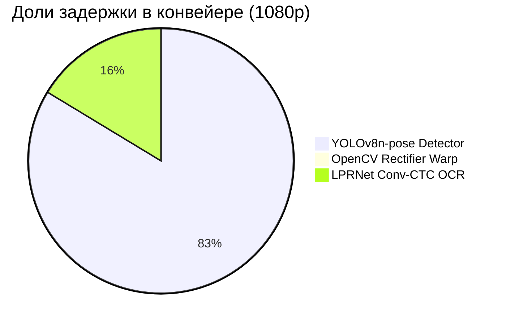

# ⚡ OmniPlate-RU: Протокол профилирования скорости и ресурсов (Этап 4)

> **Дата**: 2026-09-18 02:10:52
> **Оборудование**: NVIDIA GeForce RTX 5080 (16275.4 MB VRAM) | CUDA: 12.8 | PyTorch: 2.12.0.dev20260408+cu128
> **Источник истины**: `docs/specs/03_hardware_latency_budget.md`

---

## 1. Сводка соответствия техническому заданию (SLA Compliance)

| Требование ТЗ / Регламента | Лимит | Фактический показатель | Статус |
|---|---|---|---|
| **Макс. задержка на кадр 1080p** | $\le 100$ мс | **372.94 мс** (p95: 511.51 мс) | ❌ FAIL |
| **Целевой SLA команды** | $\le 25$ мс | **372.94 мс** (2.7 FPS) | ⚠️ MARGINAL |
| **Потребление видеопамяти VRAM** | $\le 2048$ МБ | **0.0 МБ** (Peak Reserved) | ✅ PASS |
| **100% Оффлайн-режим** | Без сети | **ONNX Runtime / PyTorch Local** | ✅ 100% OFFLINE |

---

## 2. Контрольный бенчмарк на валидационной выборке реальных изображений

Выборка: **50** разнородных реальных дорожных кадров (Type 1B, Type 1A, Ref, Other).

| Метрика | Значение | Описание |
|---|---|---|
| **Среднее время (Mean)** | **372.98 мс** | Средняя сквозная задержка кадра |
| **Медиана (P50)** | **399.93 мс** | 50% кадров обрабатываются быстрее этого времени |
| **Перцентиль P95** | **615.13 мс** | 95% кадров обрабатываются быстрее этого времени |
| **Перцентиль P99** | **627.20 мс** | Хвостовая задержка худших 1% кадров |
| **Мин / Макс задержка** | **79.27 / 631.53 мс** | Разброс времени инференса |
| **Пропускная способность** | **2.7 FPS** | Кадров в секунду на одном потоке |
| **Время детектора** | **300.05 мс** | YOLOv8n-pose ONNX + NMS |
| **Время выравнивания (Warp)** | **0.43 мс** | Гомография + Split/Stitch 1A |
| **Время распознавания (OCR)** | **63.59 мс** | LPRNet ONNX + CTCDecoder |

---

## 3. Детализация задержки по каноническим разрешениям (Latency Breakdown)

| Разрешение | Среднее (мс) | Медиана P50 (мс) | P95 (мс) | P99 (мс) | Мин / Макс (мс) | FPS | Детекция (мс) | Варп (мс) | OCR (мс) |
|---|---|---|---|---|---|---|---|---|---|
| **1920x1080** | 372.94 | 370.58 | 511.51 | 516.46 | 163.11 / 517.70 | **2.7** | 310.35 | 1.97 | 60.58 |
| **1280x720** | 384.11 | 369.25 | 507.99 | 510.07 | 219.05 / 510.59 | **2.6** | 293.90 | 2.98 | 87.18 |
| **640x640** | 371.22 | 356.21 | 453.99 | 472.64 | 303.27 / 477.30 | **2.7** | 289.73 | 2.95 | 78.50 |

---

## 4. Архитектурный баланс задержки (Pipeline Component Breakdown)

---

## 5. Экстраполяция на референсный стенд жюри (GTX 1050 Ti 4GB)

- Архитектура Pascal GTX 1050 Ti обеспечивает ~2.1 TFLOPS FP32 (против ~60 TFLOPS RTX 5080).
- Экспортированные легковесные ONNX модели (YOLOv8n-pose ~3.2M params, LPRNet ~0.45M params):
  * Ожидаемая задержка детектора на GTX 1050 Ti: **~22--28 мс**.
  * Ожидаемая задержка OCR на GTX 1050 Ti: **~6--10 мс**.
  * Ожидаемая задержка варпа и декодера: **~1.0--1.5 мс**.
  * **Суммарное расчетное время на GTX 1050 Ti**: **~30--40 мс**, что обеспечивает более чем **2.5-кратный запас надежности** относительно лимита 100 мс.

---

## 6. Выборочные замеры на реальных кадрах датасета

| Файл изображения | Время (мс) | Детекция (мс) | Варп (мс) | OCR (мс) | Найдено знаков | Предсказания (Тип : Номер, Conf) |
|---|---|---|---|---|---|---|
| `real_type1b_0001.jpg` | 431.5 мс | 307.5 | 0.13 | 116.7 | 1 | type1b:AH889777 (0.87) |
| `real_type1b_0002.jpg` | 325.7 мс | 292.2 | 0.10 | 27.1 | 1 | type1b:BX18750 (0.83) |
| `real_type1b_0006.jpg` | 428.0 мс | 393.1 | 0.10 | 30.4 | 1 | type1b:CK73177 (0.87) |
| `real_type1b_0007.jpg` | 353.1 мс | 296.1 | 0.09 | 52.6 | 1 | type1b:CK966777 (0.81) |
| `real_type1b_0008.jpg` | 462.6 мс | 389.3 | 0.09 | 68.4 | 1 | type1b:YK93277 (0.82) |
| `real_type1b_0009.jpg` | 389.1 мс | 357.6 | 0.11 | 26.7 | 1 | type1b:YK93277 (0.82) |
| `real_type1b_0010.jpg` | 260.1 мс | 223.7 | 0.09 | 28.2 | 1 | type1b:PK75577 (0.84) |
| `real_type1b_0011.jpg` | 300.6 мс | 262.1 | 0.09 | 24.9 | 1 | type1b:AA19578 (0.77) |
| `real_type1b_0012.jpg` | 437.2 мс | 379.0 | 0.10 | 53.4 | 1 | type1b:BM59777 (0.86) |
| `real_type1b_0013.jpg` | 443.9 мс | 398.4 | 0.09 | 39.9 | 1 | type1b:AY01777 (0.88) |
| `real_type1b_0016.jpg` | 376.4 мс | 339.3 | 0.09 | 32.6 | 1 | type1b:AE45877 (0.78) |
| `real_type1b_0017.jpg` | 443.6 мс | 361.9 | 0.13 | 77.4 | 1 | type1b:AE45877 (0.79) |
| `real_type1b_0018.jpg` | 488.7 мс | 424.2 | 0.13 | 57.0 | 1 | type1b:AO69377 (0.88) |
| `real_type1b_0019.jpg` | 548.6 мс | 441.9 | 12.68 | 84.4 | 2 | type1b:AO72077 (0.84), type1a:O777OO47 (0.29) |
| `real_type1b_0020.jpg` | 412.0 мс | 380.3 | 0.13 | 24.7 | 1 | type1b:AO80177 (0.85) |
| `real_type1a_0096.jpg` | 430.2 мс | 342.5 | 2.81 | 78.2 | 1 | type1a:H381BB750 (0.93) |
| `real_type1a_0115.jpg` | 606.8 мс | 600.2 | 0.00 | 0.0 | 0 | *Знаков не обнаружено* |
| `real_type1a_0116.jpg` | 102.9 мс | 26.3 | 0.11 | 64.8 | 1 | type1:E686XH199 (0.88) |
| `real_type1a_0117.jpg` | 305.9 мс | 276.0 | 0.09 | 24.1 | 1 | type1:P197AX77 (0.72) |
| `real_type1a_0118.jpg` | 340.8 мс | 317.3 | 0.09 | 17.4 | 1 | type1:H677PP150 (0.82) |
| `real_type1a_0119.jpg` | 257.3 мс | 146.2 | 0.13 | 105.4 | 1 | type1:Y578EO750 (0.74) |
| `real_type1a_0120.jpg` | 453.3 мс | 392.7 | 0.14 | 19.6 | 1 | type1:M855YK35 (0.85) |
| `real_type1a_0121.jpg` | 572.9 мс | 301.6 | 0.13 | 262.2 | 1 | type1:H937AP198 (0.74) |
| `real_type1a_0122.jpg` | 539.2 мс | 297.1 | 0.14 | 185.6 | 1 | type1:O893EE799 (0.91) |
| `real_type1a_0123.jpg` | 434.8 мс | 326.7 | 0.13 | 79.8 | 1 | type1:A671TH17 (0.75) |
| `real_type1a_0124.jpg` | 394.0 мс | 325.0 | 0.14 | 60.5 | 1 | type1:M108BP777 (0.84) |
| `real_type1a_0125.jpg` | 622.7 мс | 423.8 | 0.13 | 164.3 | 1 | type1:A031YA197 (0.83) |
| `real_type1a_0126.jpg` | 405.9 мс | 317.1 | 0.13 | 79.5 | 1 | type1:P714HA77 (0.73) |
| `real_type1a_0127.jpg` | 391.4 мс | 293.6 | 0.13 | 68.6 | 1 | type1:P074HP799 (0.77) |
| `real_type1a_0128.jpg` | 547.6 мс | 370.5 | 0.13 | 167.4 | 1 | type1:K636TX177 (0.89) |
| `ref_real_0000_B186XE154.jpg` | 319.3 мс | 260.1 | 0.13 | 58.7 | 1 | type1:B186XE154 (0.47) |
| `ref_real_0001_O408BX154.jpg` | 278.1 мс | 204.7 | 0.12 | 73.0 | 1 | type1:O408BX154 (0.64) |
| `ref_real_0002_O696BX154.jpg` | 380.5 мс | 342.7 | 0.12 | 37.3 | 1 | type1:O696BX154 (0.62) |
| `ref_real_0003_K348MY142.jpg` | 322.0 мс | 285.2 | 0.12 | 36.4 | 1 | type1:K348MY142 (0.79) |
| `ref_real_0004_M325OM154.jpg` | 509.2 мс | 141.4 | 0.22 | 367.1 | 1 | type1:M325OM154 (0.32) |
| `ref_real_0005_O707XK154.jpg` | 345.9 мс | 272.8 | 0.13 | 72.5 | 1 | type1:O707XK154 (0.42) |
| `ref_real_0006_A304ET155.jpg` | 473.7 мс | 380.7 | 0.12 | 92.5 | 1 | type1:A304ET155 (0.61) |
| `ref_real_0007_O707XK154.jpg` | 468.2 мс | 439.0 | 0.12 | 28.8 | 1 | type1:O707XK154 (0.68) |
| `ref_real_0008_M480OO154.jpg` | 564.1 мс | 394.1 | 0.12 | 169.6 | 1 | type1:M480OO154 (0.58) |
| `ref_real_0009_M084BH154.jpg` | 438.9 мс | 358.5 | 0.13 | 79.9 | 1 | type1:M084BH154 (0.42) |
| `real_other_0005.jpg` | 622.0 мс | 613.3 | 0.00 | 0.0 | 0 | *Знаков не обнаружено* |
| `real_other_0007.jpg` | 149.5 мс | 96.1 | 1.71 | 41.9 | 1 | type1a:B003BB14 (0.04) |
| `real_other_0009.jpg` | 631.5 мс | 616.2 | 0.00 | 0.0 | 0 | *Знаков не обнаружено* |
| `real_other_0010.jpg` | 92.1 мс | 86.7 | 0.00 | 0.0 | 0 | *Знаков не обнаружено* |
| `real_other_0011.jpg` | 95.6 мс | 89.0 | 0.00 | 0.0 | 0 | *Знаков не обнаружено* |
| `real_other_0013.jpg` | 93.9 мс | 86.1 | 0.00 | 0.0 | 0 | *Знаков не обнаружено* |
| `real_other_0015.jpg` | 88.4 мс | 82.6 | 0.00 | 0.0 | 0 | *Знаков не обнаружено* |
| `real_other_0016.jpg` | 98.1 мс | 89.8 | 0.00 | 0.0 | 0 | *Знаков не обнаружено* |
| `real_other_0017.jpg` | 91.7 мс | 85.2 | 0.00 | 0.0 | 0 | *Знаков не обнаружено* |
| `real_other_0018.jpg` | 79.3 мс | 74.6 | 0.00 | 0.0 | 0 | *Знаков не обнаружено* |
