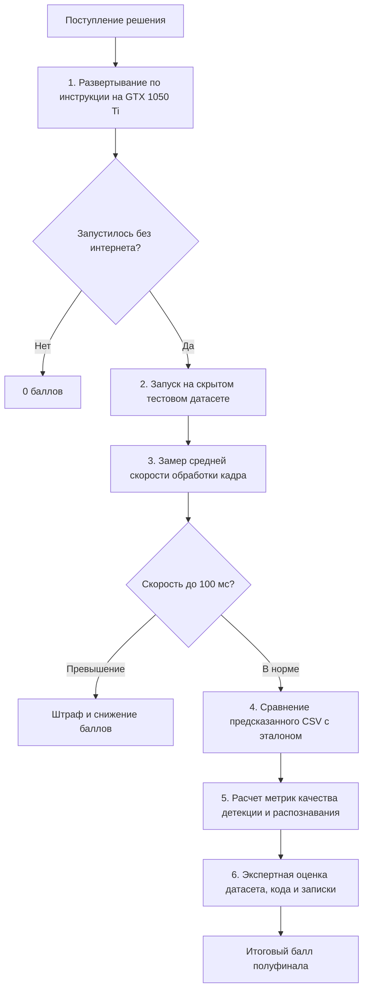

# 04. Состав сдачи и регламент оценки

## 1. Обязательный комплект артефактов для сдачи

Участник обязан предоставить жюри следующие 5 компонентов:

1. **Исходный код решения с обученными моделями**:
   - Полный код пайплайна инференса.
   - Обученные веса моделей, готовые к запуску на GTX 1050 Ti без скачивания из интернета.
   - Ссылка на публичный/доступный репозиторий (GitHub, GitFlic) или облачное хранилище (Яндекс.Диск, Cloud Mail).
2. **Датасет**:
   - Строго по структуре раздела 6 задания (`dataset/images/`, `labels/`, `meta.csv`, `README.md`, `LICENSE`).
   - Приложенный официальный **отчёт валидатора `validate_dataset.py`**.
3. **Скрипты обучения и генерации**:
   - Полный воспроизводимый код обучения моделей (`train.py`, ноутбуки).
   - Скрипт генератора синтетических изображений с зафиксированным random seed.
4. **Инструкция по сборке и запуску (RUNBOOK)**:
   - Четкие шаги установки окружения (`pip install -r requirements.txt`).
   - **Точная команда запуска** инференса на произвольном каталоге изображений:
     ```bash
     python run.py --input <path_to_images_folder> --output results.csv
     ```
5. **Пояснительная записка (до 5 страниц)**:
   - Описание источников данных и методики фильтрации/аугментации.
   - Методика генерации синтетики.
   - Теоретическое и практическое обоснование выбранной архитектуры (детекция + OCR).
   - Таблица замеров скорости и FPS на доступном железе.
   - Известные ограничения и краевые случаи.
   - Идеи масштабирования на другие типы знаков и страны.

---

## 2. Порядок и этапы проверки жюри



---

## 3. Критерии автоматического сопоставления и штрафы

1. **Сопоставление номеров**:
   - Строгое совпадение строки `plate_num` (100% символов).
   - Частичное совпадение с учётом нераспознанных символов `#`.
   - Точность определения типа знака (`type1`, `type1a`, `type1b`, `other`).
2. **Нулевые баллы выставляются за**:
   - Захардкоженные ответы под конкретные имена файлов;
   - Обращения к сетевым ресурсам и API во время работы инференса;
   - Невозможность собрать и запустить решение по инструкции;
   - Включение в датасет чужих материалов с несовместимой лицензией;
   - Фальсификацию разметки (включая невалидированную разметку чужой нейросетью, выданную за ручную).
