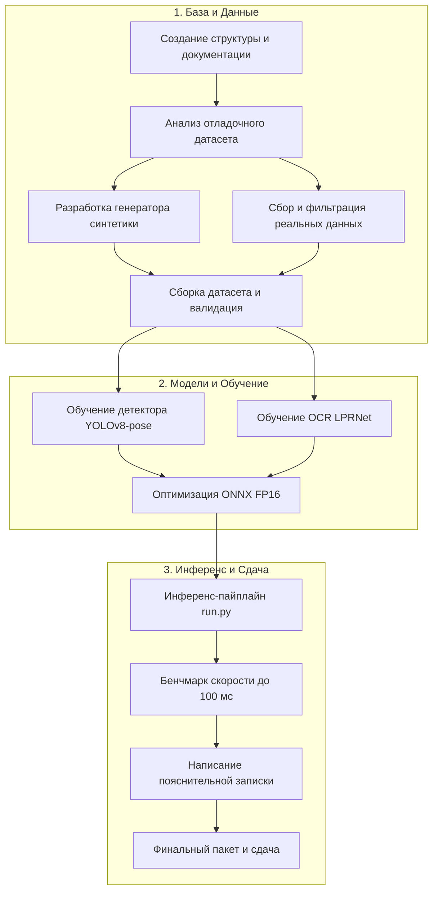

# План реализации проекта (Milestones & Action Plan)

## 📌 Дорожная карта проекта

---

## 🎯 Чек-лист майлстоунов

### Майлстоун 1: Инфраструктура и документация (Выполнено ✅)
- [x] Создание структуры репозитория на `Y:\AIProjects\VolgaIT`.
- [x] Настройка исключений Remote Workstation / Tailscale SMB (`.vscode/settings.json`).
- [x] Формирование `CONSTITUTION.md` с незыблемыми правилами.
- [x] Разработка разветвленной документации в `docs/` (`requirements`, `architecture`, `data`, `workflow`).

---

### Майлстоун 2: Отладочный датасет организаторов
- [ ] Скачать и распаковать 30 эталонных изображений и CSV с `https://cloud.aisgorod.ru/s/PYDM6sSx4GT1pj4`.
- [ ] Проверить формат разметки, структуру столбцов, особенности съемки.
- [ ] Получить скрипт валидации `validate_dataset.py` (если приложен организаторами).

---

### Майлстоун 3: Генератор синтетики (Synthesis Engine)
- [ ] Разработать скрипт `dataset/generator/generate_synthetic.py`.
- [ ] Реализовать рендеринг шрифта ГОСТ для типов `type1`, `type1a`, `type1b`.
- [ ] Добавить текстуры потертостей, грязи, бликов, теней.
- [ ] Реализовать случайную 3D-перспективную трансформацию с расчетом истинных координат `quad`.
- [ ] Протестировать с фиксированным аргументом `--seed 42` на 5000+ изображениях.

---

### Майлстоун 4: Реальные данные и Анонимизация
- [ ] Сбор базы изображений типов 1А (квадратные $\ge 150$), 1Б (желтые $\ge 300$), Other ($\ge 50$).
- [ ] Автоматическое размытие лиц (Face Blur).
- [ ] Разметка BBox + 4 угловые точки (Quad).
- [ ] Заполнение `meta.csv` со ссылками на совместимые лицензии (CC BY 4.0).
- [ ] Запуск `validate_dataset.py` и сохранение отчета.

---

### Майлстоун 5: Обучение моделей (Host PC с RTX 5080)
- [ ] Обучение YOLOv8n-pose / YOLO11n-pose на детекцию пластин и 4 угловых точек.
- [ ] Обучение LPRNet / CRNN CTC на распознавание символов (с поддержкой split-обработки 1А).
- [ ] Экспорт моделей в формат **ONNX FP16** для максимальной скорости на GTX 1050 Ti.

---

### Майлстоун 6: Инференс-скрипт `run.py` и профилирование
- [ ] Реализация CLI интерфейса: `python run.py --input <dir> --output <results.csv>`.
- [ ] Замер среднего времени обработки одного изображения (контроль $< 100\text{ мс}$).
- [ ] Проверка автономности: запуск в изолированном режиме без сети.

---

### Майлстоун 7: Подготовка финального пакета сдачи
- [ ] Оформление `dataset/README.md` (datasheet) и `dataset/LICENSE`.
- [ ] Оформление `README.md` с точной инструкцией по установке и запуску для жюри.
- [ ] Написание 5-страничной пояснительной записки (отчет с графиками, обоснованиями архитектуры и замерами).
- [ ] Проверка чек-листа соответствия правилам [CONSTITUTION.md](../../CONSTITUTION.md).
